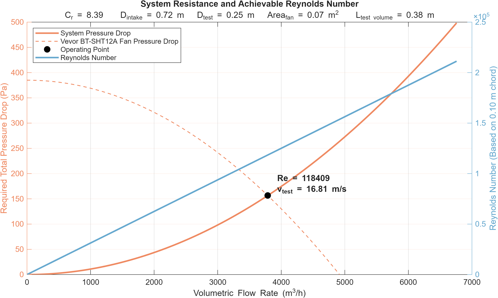
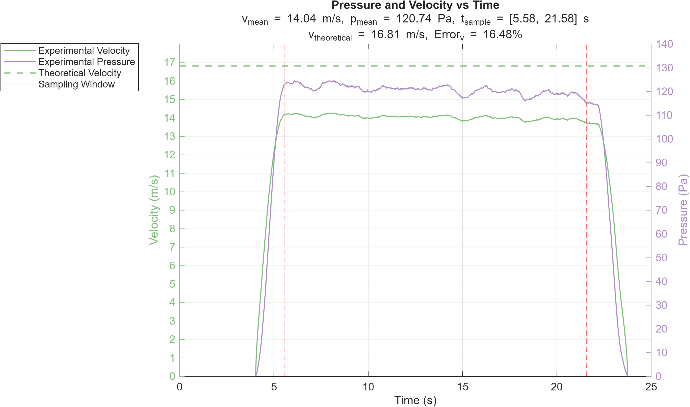

# Subsonic Wind Tunnel
This repository contains the MATLAB and C++ scripts I wrote to optimize the geometry, record sensor telemetry, and analyze the experimental data for my wind tunnel.

## Files and Relevant Output

### 1. `WindTunnelCalculator2.m`
Optimizes geometry and calculates performance of an open-return wind tunnel with a square cross section.



**Console Output:**
```text
Best Operating Point Found:
Flow Rate = 3787.64 m^3/h
Pressure = 156.54 Pa
Re = 118,409
Test Section Velocity = 16.81 m/s

bestGeometry = 

  struct with fields:
           theta_diffuser: 4.5
                      C_r: 8.39
                 D_intake: 0.72
             C_testvolume: 1.50
        C_contractioncone: 0.75
               numScreens: 2
           frictionFactor: 0.02
               L_diffuser: 0.35
        L_contractioncone: 0.54
             A_testvolume: 0.063
                 A_intake: 0.52
             D_testvolume: 0.25
             L_testvolume: 0.375
    L_square_to_circ_loft: 0.063
```
	
### 2. `WindTunnelVelocityPlotting.m`
Reads the downloaded serial output from the Arduino Uno R3, and plots the airspeed over time.



### 3. `arduinoSoftware.cpp`
Outputs airspeed telemetry from the MPXV7002DP sensor for the Arduino Uno R3.
